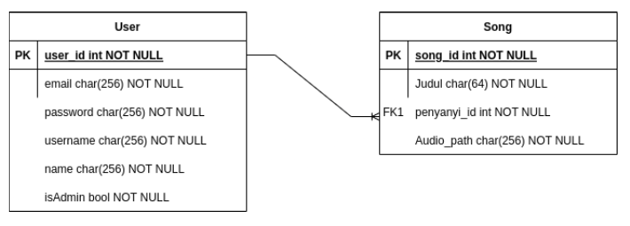

# Binotify: REST Service

## Deskripsi web service

Service yang bisa menangani pengelolaan lagu premium oleh seorang penyanyi dan passing request/response ke Binotify SOAP Service. Service ini dibangun dengan NodeJS

## Skema basis data yang digunakan

## Penjelasan mengenai pembagian tugas masing-masing anggota

-   Backend Binotify Premium Database : 13520139
-   Backend Binotify Premium Autentikasi Pengguna : 13520103, 13520139
-   Backend Binotify Premium Pengelolaan Lagu Premium : 13520139
-   Backend Binotify Premium Endpoint List Penyanyi : 13520018
-   Backend Binotify Premium Endpoint List Lagu dari Penyanyi : 13520103, 13520018
